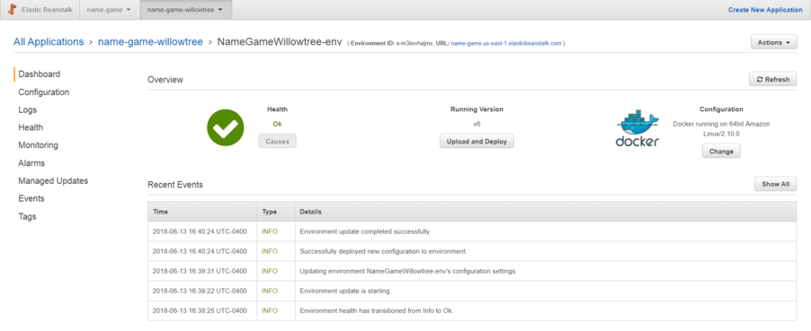

[](https://travis-ci.org/Zakinator123/name-game)
<h1 style="text-align: center"> The Name Game API </h1>
<h5 style="text-align: center"> https://api.the-name-game.com </h4>


The Name Game API is a simple RESTful JSON API that can be used together with any simple client (e.g. a mobile app, or web app) to build a full game. The API manages user authentication/sessions, game question formulation based on game modes, answer submission handling, user game session statistics tracking, and more.

The API has 6 endpoints, each of which have their inputs/outputs documented thoroughly in [main.py](https://github.com/Zakinator123/name-game/blob/master/app/main.py):

`/signup`

`/login`

`/game`

`/stop_game`

`/leaderboard`

`/logout`


The most important of these is arguably the `game/` endpoint, which I will briefly summarize. It takes as input (via a JSON dictionary in the POST body using the `application/json` encoding) a `token` (for user authentication) and either a `game_type` or `answer`.

- If a `game_type` is specified (can be 'standard', 'reverse', or 'matt'), a new game session is created and the API will return a JSON response containing everything needed for a new round of the Name Game: a question, answer choices, pictures, and more.

- If an `answer` is specified in the POST request, the user's session stats (e.g. number wrong/right) are updated and the API will return a JSON reponse similar to above with either the same question (if the user was wrong), or a new question, along with session stats.

Here is a sample JSON response returned by the `/game` endpoint when a `game_type='reverse'` input is provided:
```
{
    "game_type": "reverse",
    "last_answer_submission": "None",
    "message": "A new game was created, and a new question has been created.",
    "question": {
        "choice_type": "text",
        "choices": [
            {
                "choice": "Austen Lux",
                "id": "2vhctN1Zfeo6EeUc0maEUG"
            },
            {
                "choice": "Evan Tatarka",
                "id": "6bKffcIDjGUsU8cEiCAkWK"
            },
            ...
        ],
        "question_image": {
            "alt": "Michael Signer, General Counsel at WillowTree, Inc.®",
            "height": 664,
            "id": "1ySnDVE7CEieO8A8giCCa8",
            "mimeType": "image/png",
            "type": "image",
            "url": "//images.ctfassets.net/3cttzl4i3k1h/1ySnDVE7CEieO8A8giCCa8/a64437f04ae15f186c2868f2b30e4759/mike.png",
            "width": 664
        },
        "question_text": "Who is in this picture?"
    },
    "session_number_right": 0,
    "session_number_wrong": 0,
    "status": "Success"
}
```


# Infrastructure
The Name Game API is served by a Flask app running on a [docker container](https://hub.docker.com/r/zakinator123/name-game/~/dockerfile/) and is reliant on a MySQL database.

### Production Infrastructure
The Name Game API is currently deployed on AWS and is highly available and durable. It is running on two containers in AWS Elastic Beanstalk, each of which are in different availability zones. These containers are behind an Elastic Load Balancer that handles SSL Termination and are also in an auto-scaling group that can scale the deployment to five containers if traffic becomes heavy (you never know!). Both containers are using a MySQL database running on RDS.




### Continous Integration and Testing
Upon pushes to Github, a Travis CI build is triggered. Travis launches a MySQL container, initializes tables/data, and then launches a container for the Name Game API. Lastly, it runs several unit tests on the API endpoints, and upon successful testing, triggers a Dockerhub build that's subsequently used by the Elastic Beanstalk deployment. You can see the latest Travis CI build [here](https://travis-ci.org/Zakinator123/name-game)


# Design Approach
When planning out the endpoints, inputs, and outputs of the API, I tried to imagine myself as an application developer using my API. I drew several state diagrams representing the different 'pages' or 'views' of game application variants using my API, and thought about all the possible state transitions that could occur from each page, as well as what data I would need to retrieve/submit during each of those state-transitions.

As per directions, I strove to make the API as simple as possible for the client application - no endpoint requires more than two inputs.


# Database Schema

```
 User Table
+----------+--------------+------+-----+---------+-------+
| Field    | Type         | Null | Key | Default | Extra |
+----------+--------------+------+-----+---------+-------+
| username | varchar(96)  | NO   | PRI | NULL    |       |
| password | varchar(256) | YES  |     | NULL    |       |
+----------+--------------+------+-----+---------+-------+
```

```
Authenticator Table
+-----------+-------------+------+-----+---------+-------+
| Field     | Type        | Null | Key | Default | Extra |
+-----------+-------------+------+-----+---------+-------+
| token     | varchar(96) | NO   | PRI | NULL    |       |
| username  | varchar(96) | YES  | MUL | NULL    |       |
| timestamp | varchar(20) | YES  |     | NULL    |       |
+-----------+-------------+------+-----+---------+-------+
```

```
Game Session Table
+---------------------------+-------------+------+-----+---------+----------------+
| Field                     | Type        | Null | Key | Default | Extra          |
+---------------------------+-------------+------+-----+---------+----------------+
| session_id                | int(11)     | NO   | PRI | NULL    | auto_increment |
| username                  | varchar(96) | YES  | MUL | NULL    |                |
| game_type                 | varchar(96) | YES  | MUL | NULL    |                |
| number_right              | int(11)     | YES  |     | NULL    |                |
| number_wrong              | int(11)     | YES  |     | NULL    |                |
| current_question          | text        | YES  |     | NULL    |                |
| current_session           | tinyint(1)  | YES  |     | NULL    |                |
| current_question_answer   | varchar(96) | YES  |     | NULL    |                |
+---------------------------+-------------+------+-----+---------+----------------+
```

```
Game Type Table
+------------------+-------------+------+-----+---------+-------+
| Field            | Type        | Null | Key | Default | Extra |
+------------------+-------------+------+-----+---------+-------+
| game_name        | varchar(96) | NO   | PRI | NULL    |       |
| choice_type      | varchar(96) | YES  |     | NULL    |       |
| job_title_filter | varchar(96) | YES  |     | NULL    |       |
| name_filter      | varchar(96) | YES  |     | NULL    |       |
| num_choices      | int(11)     | YES  |     | NULL    |       |
+------------------+-------------+------+-----+---------+-------+
```